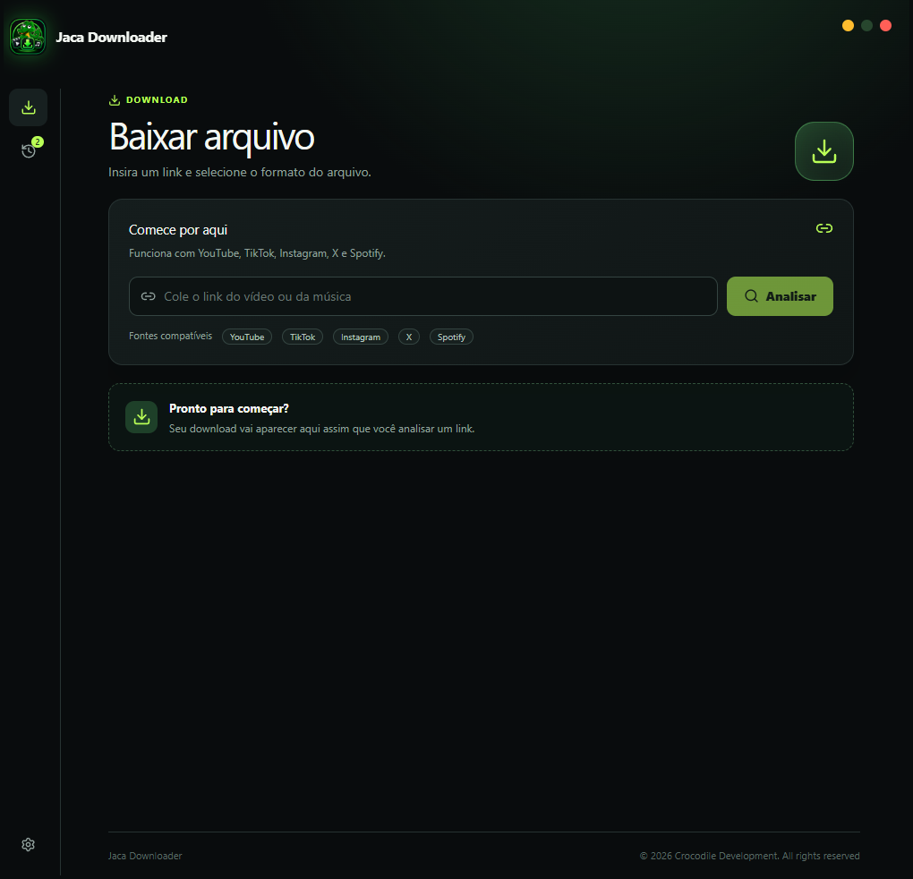

# Jaca Downloader

A Windows app to download video and audio from YouTube, TikTok, Instagram, X and Spotify.
Paste a link, pick the format, and the file is saved on your computer.

The interface is in Brazilian Portuguese.



## Download

Get the latest version from the [Releases page](https://github.com/RamonMarcelLopes/JacaDownloader/releases/latest).
Under **Assets**, download `JacaDownloader-vX.Y.Z-win-x64.zip`.

Do not use **Source code (zip)** or the green **Code > Download ZIP** button: those contain only the
source code, not the program.

## Getting started

1. Extract the zip (right click, **Extract all...**).
2. Double-click `JacaDownloader.exe`. It is a single file with the .NET runtime inside, so there is
   nothing else to install.
3. On the first run, keep the internet connected. The app downloads yt-dlp and ffmpeg once (about
   150 MB), and checks for a newer yt-dlp at most once a day.
4. Paste a link, click **Analisar**, choose video (MP4) or audio (MP3), and click **Baixar agora**.

If Windows SmartScreen shows **Windows protected your PC**, click **More info** and then **Run anyway**.
It appears because the executable is not code-signed.

## Features

- Video in MP4 with the quality of your choice (only the qualities that exist for that video are
  offered), or audio in MP3.
- Download history with search, filters and sorting, with the actions **show in folder**,
  **open file**, **copy link**, **retry**, and **download in another format**.
- Spotify links: the app finds the same track on YouTube and saves it as MP3 (single tracks only,
  not playlists or albums).
- Optional use of your browser login (Chrome, Edge, Firefox or Brave) for posts that require one,
  such as some Instagram and X posts.
- Settings for the default folder, default format and quality, theme (light, dark or follow
  Windows) and how long the history is kept.
- Remembers where you left the window, and never opens it outside the available screens.
- Files are saved in your Windows Music folder unless you choose another folder.

## Requirements

- Windows 10 or 11, 64-bit.
- Microsoft Edge WebView2 Runtime. It comes with Windows 11 and most up-to-date Windows 10
  installations.
- Internet access (on the first run to fetch the tools, and for every download).

## Your data

Everything the app stores is in `%LocalAppData%\JacaDownloader`:

| Item | Purpose |
| --- | --- |
| `settings.json` | your settings |
| `history.json` and `thumbs\` | download history and its thumbnails |
| `window.json` | last window position and size |
| `tools\` | yt-dlp and ffmpeg |
| `webview\` | data of the embedded browser |

To remove the app, delete `JacaDownloader.exe` and that folder. The app has no accounts and sends no
telemetry. It only connects to the sites you download from, to GitHub (to fetch and update yt-dlp
and ffmpeg), and to a Spotify track page when you paste a Spotify link.

## Build from source

Requirements: Windows, the .NET 8 SDK, Node.js and pnpm.

```
build.bat
```

The script builds the interface (`ui`), exports it as static files, and publishes a self-contained
single-file executable to `dist\JacaDownloader.exe`. The license allows building the unmodified
source for your own use.

## How it works

- `JacaDownloader.exe` is a .NET 8 WinForms window that hosts an embedded browser (WebView2).
- The interface is a Next.js app exported as static files and embedded in the executable. A small
  local web server (bound to `127.0.0.1` on a random port) serves it and exposes the API that the
  interface uses.
- Downloads run through yt-dlp, and ffmpeg merges and converts the files.

```
Program.cs     entry point and local API routes
MainForm.cs    borderless window hosting the embedded browser
Downloader.cs  yt-dlp wrapper: link analysis, download jobs and progress
Store.cs       settings and history persistence
Models.cs      data models
Tools.cs       downloads and updates yt-dlp and ffmpeg
Assets/        application icon
ui/            the interface (Next.js)
build.bat      builds the interface and publishes the executable
```

## Responsible use

Download only content that you have permission to download. You are responsible for respecting
copyright laws and the terms of use of the websites you access.

## License

Jaca Downloader is free to use, but it may not be modified or sold. See [LICENSE](LICENSE) for the
full terms.

## Credits

Built on [yt-dlp](https://github.com/yt-dlp/yt-dlp), [FFmpeg](https://ffmpeg.org),
[.NET](https://dotnet.microsoft.com), [Microsoft Edge WebView2](https://developer.microsoft.com/microsoft-edge/webview2),
[Next.js](https://nextjs.org), [React](https://react.dev), [Tailwind CSS](https://tailwindcss.com)
and [Lucide](https://lucide.dev) icons. Each belongs to its own authors and has its own license.
